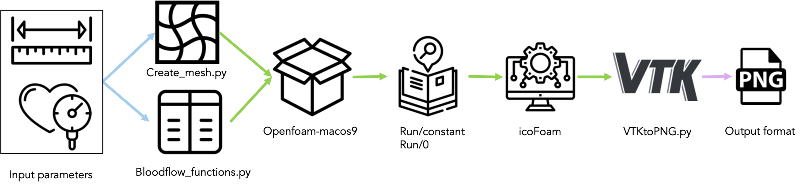

# Data Generation

To create training, validation and test data for Neural Networks (NNs) locally, first obtain OpenFoam. If via Docker, image can be built with the Dockerfile and started by 

```docker run -ti --rm -v "$PWD":/data -w /data <your given container tag>```

from your OpenFoam data directory.

First create meshes using create_mesh.py and boundary conditions using bloodflow_functions.py . Adjust OpenFoam dictionary files (details in report) and run solver. Use VTKtoPNG.py to convert generated VTK files to PNG files. PNG files are used as input for NNs. 

The whole data generation pipeline is represented in bash script: data_pipeline.sh (experimental phase). 

